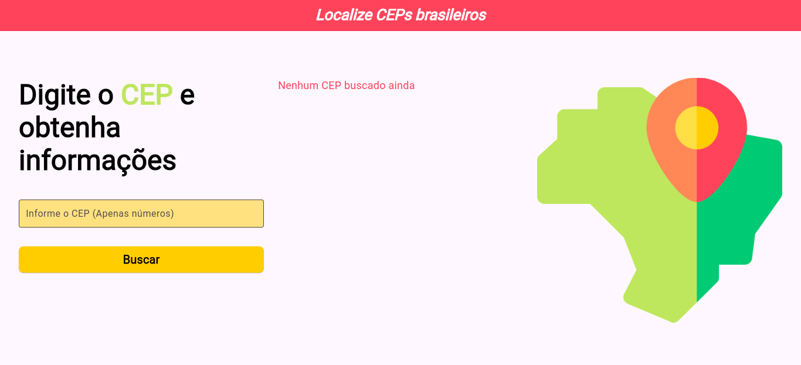
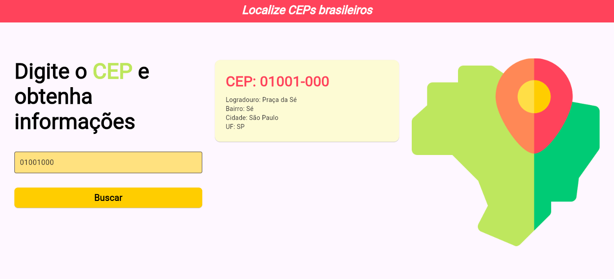

# Localiza CEPs Brasileiros

## Objetivo
Este projeto tem como objetivo criar um aplicativo Flutter que permite buscar e localizar CEPs brasileiros, exibindo informações detalhadas como logradouro, bairro, cidade e UF. O projeto faz parte do curso **Formação Flutter Especialista** da DIO.

## Detalhamento

O aplicativo funciona a partir de um campo de busca onde o usuário digita o CEP desejado. Ao enviar a solicitação, o app faz uma requisição à **API ViaCEP**, que retorna os dados correspondentes ao CEP informado. A lógica do projeto está organizada de forma que a interface (UI) e a lógica de busca sejam separadas: o botão de busca e o campo de texto ficam na tela principal, enquanto a função que consome a API está isolada em outro arquivo.

## Conclusão
Este projeto permite praticar conceitos importantes de **Flutter**, como gerenciamento de estado, requisições HTTP, tratamento de erros.
